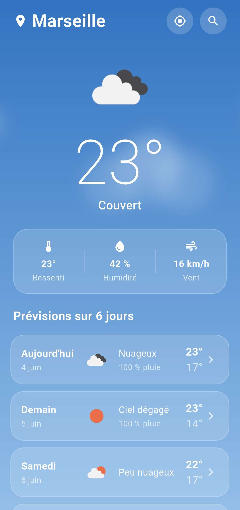
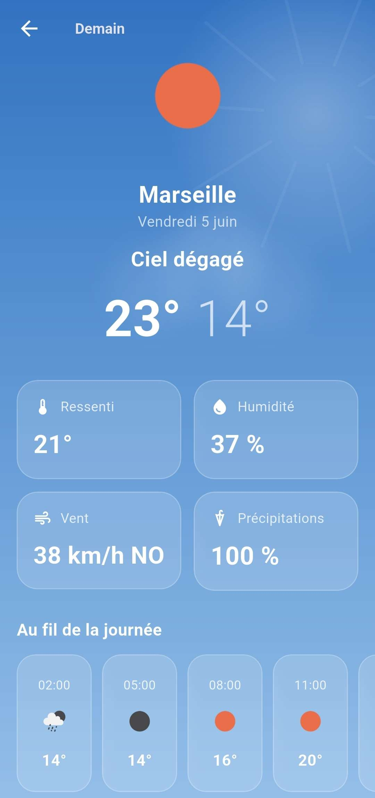

# DailySky

Application météo Flutter affichant les prévisions sur 5 jours avec un écran de détail par jour. Basée sur l'API OpenWeatherMap, Material 3, architecture MVVM et gestion d'erreurs robuste.

## Captures d'écran

<p align="center">
  
  
</p>

## Principales fonctionnalités

- Écran principal avec en-tête dynamique et liste des prévisions
- Écran de détail avec température ressentie, humidité, vent, précipitations et timeline horaire
- Localisation par GPS avec fallback automatique sur une ville par défaut
- Recherche de ville
- Gestion complète des erreurs (chargement, succès, erreur) sans crash
- Cache hors-ligne via `shared_preferences`
- Animations météo réactives (nuages, soleil, étoiles, pluie, neige, éclair)

## Installation

1. **Flutter 3.44+** requis. Vérifiez avec `flutter doctor`.
2. **Clé API OpenWeatherMap** (gratuite) : créez un compte sur [openweathermap.org](https://home.openweathermap.org/users/sign_up)
3. Configurez la clé en copiant `env.example.json` -> `env.json` et ajoutez votre clé :

```json
{
  "OWM_API_KEY": "votre_cle"
}
```

4. Installez les dépendances : `flutter pub get`

## Lancer sur Android

1. Activez Débogage USB sur le téléphone et branchez en USB
2. Vérifiez : `flutter devices`
3. Mode debug : `flutter run --dart-define-from-file=env.json`
4. Build release : `flutter build apk --release --dart-define-from-file=env.json`

L'APK est généré dans `build/app/outputs/flutter-apk/app-release.apk`

## Lancer sur iOS

Requiert macOS + Xcode (non testé, absence de Mac) :

```bash
cd ios && pod install && cd ..
open ios/Runner.xcworkspace   # Définir une Team de signature dans Xcode
flutter run --dart-define-from-file=env.json
```

## Tests & qualité

```bash
flutter analyze      # Linting
flutter test         # Tests unitaires + widgets
```

Tests : regroupement prévisions par jour, mapping erreurs API, transitions ViewModel, écran principal.

## Notes

- L'activation d'une nouvelle clé API peut prendre jusqu'à 2 heures
- Sur Windows, les verrous antivirus sur le dossier `build/` peuvent bloquer la compilation : excluez le dossier du projet de vos scans
- Endpoints utilisés (offre gratuite) : `/data/2.5/forecast` (prévision 5 jours / 3 h, regroupée par jour) et `/data/2.5/weather` (météo actuelle)
- Pour l'architecture, voir les dossiers : `config/`, `core/`, `data/`, `presentation/`, `shared/`
